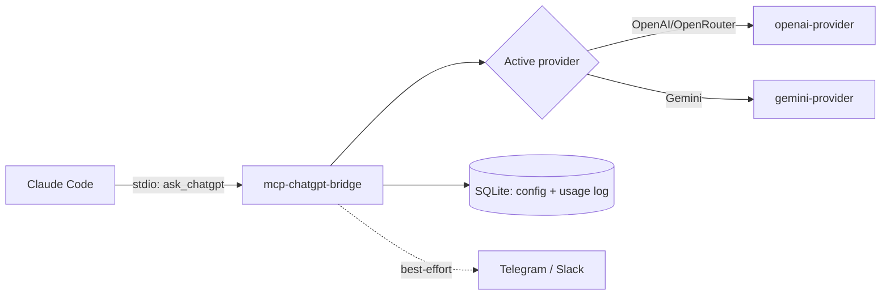

# mcp-chatgpt-bridge

[](https://nodejs.org)
[](https://modelcontextprotocol.io)


MCP server that lets Claude Code consult an AI advisor (OpenAI or Gemini, configurable via web dashboard) for a second opinion mid-task, with explicit context passed by the caller.

## Contents

- [What it does](#what-it-does)
- [Features](#features)
- [Quickstart](#quickstart)
- [The `ask_chatgpt` tool](#the-ask_chatgpt-tool)
- [Architecture](#architecture)
- [Project Status](#project-status)
- [Documentation](#documentation)
- [License](#license)

## What it does

When Claude Code is stuck on a design decision, needs a cross-check, or wants an independent opinion, it can call the `ask_chatgpt` tool to consult an AI advisor. The advisor sees only the context you provide — it has no access to your repo, files, or conversation history.

Every consultation is automatically pushed to Telegram/Slack (if configured) so you can review the advice independently later.

## Features

- **Dual-provider** — OpenAI or Gemini, switchable via the web dashboard.
- **Key rotation (LRU + cooldown)** — spreads load across multiple keys, skips ones currently rate-limited (429).
- **Full audit log** — every question/context/answer plus all HTTP requests logged daily to `logs/YYYY-MM-DD.log`, viewable in the dashboard.
- **Best-effort notify** — pushes each consultation to Telegram/Slack in parallel; delivery failures never block the tool result.
- **No `.env` needed** — all config (API keys, active provider, notify secrets) lives in a local SQLite database, managed via `npm run web`.

## Quickstart

See [Deployment Guide](./docs/deployment-guide.md) for full setup instructions.

TL;DR:
```bash
npm install && npm run build
npm run web                         # Start the web dashboard (port 4141)
# Open http://localhost:4141, add your API key, select provider (OpenAI or Gemini)
npm run install-hooks               # restores the ask-chatgpt-gate hooks into ~/.claude (see below)
claude mcp add chatgpt-bridge -s user -- node "$(pwd)/dist/index.js"
# No -e flags needed — all config lives in the dashboard
```

## The `ask_chatgpt` tool

```
ask_chatgpt({
  question: string,    // The specific question to ask
  context: string,     // Self-contained background the AI needs
  model?: string       // Optional: override the provider's default model
})
```

The AI responds in Vietnamese with three sections: Câu hỏi (question recap), Khuyến nghị (recommendation), Giải thích (reasoning). Which provider (OpenAI or Gemini) is used is determined by the selection in the web dashboard — the tool itself always consults whoever is active.

Model precedence: if the API key picked for this call has its own model configured (set via the web dashboard — useful when a key points at a non-default endpoint like OpenRouter, whose model namespace differs from OpenAI's own), that always wins over the `model` param above. Otherwise `model` overrides the provider's default; if both are omitted, the provider's hardcoded default model is used.

## Architecture

Claude Code calls `ask_chatgpt` over stdio; the server picks an active provider/key from SQLite, dispatches the call, logs the outcome, and (best-effort, in parallel) notifies Telegram/Slack.



Two global Claude Code hooks push auto-consult behavior (one hard-blocks `AskUserQuestion` until `ask_chatgpt` has run, capped at 2 tries/session so it can't loop forever) — see [System Architecture § Global Hook Enforcement](./docs/system-architecture.md#global-hook-enforcement) for the full mechanism, error handling, and design rationale.

## Project Status

- **Maturity:** Demo / personal use (0.1.0)
- **Test suite:** None yet
- **CI/CD:** None yet
- **Known gaps:**
  - Gemini path not yet live-tested (no API key available at time of refactor completion)
  - No dashboard authentication (bare SQLite CRUD, suitable only for local single-user use)
  - usage_events table unbounded growth (no retention policy yet)

See [Project Roadmap](./docs/project-roadmap.md) for details.

## Documentation

- [Project Overview & PDR](./docs/project-overview-pdr.md) — Purpose, scope, non-goals
- [Codebase Summary](./docs/codebase-summary.md) — File-by-file breakdown and data flow
- [Code Standards](./docs/code-standards.md) — Conventions observed in this codebase
- [System Architecture](./docs/system-architecture.md) — Architecture diagram and component details
- [Deployment Guide](./docs/deployment-guide.md) — Setup, registration, environment variables
- [Project Roadmap](./docs/project-roadmap.md) — Current state and open items

## License

No `LICENSE` file yet — all rights reserved by default until one is added.
